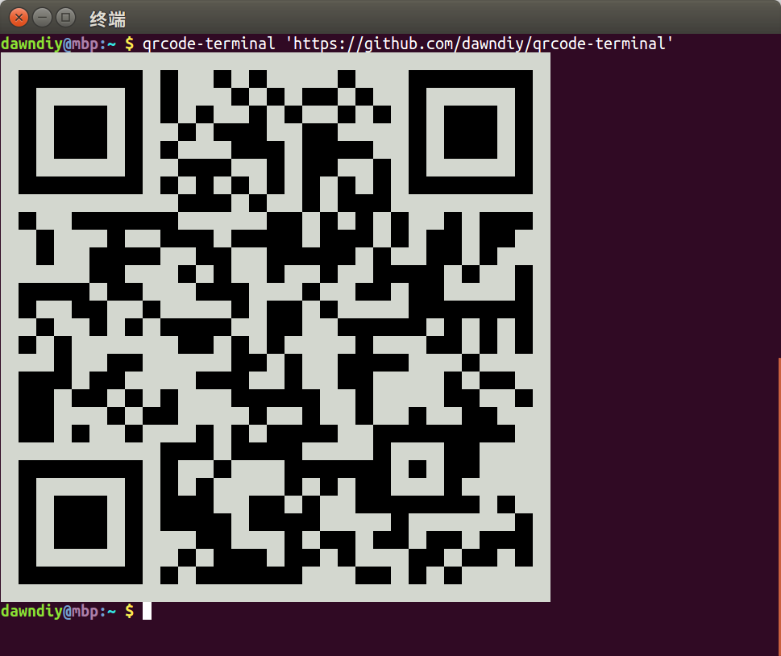

# QRCode Terminal

[](https://raw.githubusercontent.com/dawndiy/qrcode-terminal/master/LICENSE)

This is a command-line tool to generate QRCode in terminal. And supports multiple colors.



## Install

```bash
$ go get github.com/dawndiy/qrcode-terminal
```

## Usage

```bash
$ qrcode-terminal --help
$ qrcode-terminal 'https://github.com/dawndiy/qrcode-terminal'
$ qrcode-terminal -b white -f magenta 'I Love You'
```

## License

Released under the [MIT License](https://raw.githubusercontent.com/dawndiy/qrcode-terminal/master/LICENSE).
